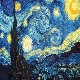

# HCI_lite
> A lite human computer interaction system, mainly dependent on you hand in your webcam.
> Author: Peng Zheng.

## Dependencies:

    OpenCV==3.4.0
    numpy==1.14.3
    matplotlib==2.2.2
    tensorflow-gpu==1.8.0    # CUDA=9, CUDNN=7.
    scikit-learn==0.19.1
    Keras==2.1.6
    face-recognition==1.2.2


## Outline:


# Mode:

- ### Guide:

```python3
video mode setting: {
"display": Default value, of which ink would fade, with tracking effect,
"styleTransfer": Stylize the whole input from webcam or only your clothes,
"calc": Do math evaluation from formula you've written on the screen,
      "evaluation": evaluate the result of handwritten formula,
"glass": Help you wear a pair of glasses,
}
```

# 

- ### Display mode:

  Drawing in the air.

- ### StyleTransfer mode:

  Style image: Yes..., it's The Starry Night again(@...@)! Here she comes:.

1. Whole input is stylized except my body:

   

2. Only clothes stylized(Gif, ahh):

   

- ### Simple Formula Evaluation:

  ​	Concerning my laptop thinkpad-t450 with i5-5200U and Geforce 940m... I used Lenet. to recognize each single character(coz this is only a very **simple** formula evaluation, I only took some basic operations into account.)

  > The shuffled dataset consists of [MNIST](http://yann.lecun.com/exdb/mnist/) and [handwrittenMathSymbol](https://www.kaggle.com/xainano/handwrittenmathsymbols/). BTW, if you're interested in recognizing a complex mathematic expression, take a look at the MathSymbol dataset, which is from a this kind of competition on Kaggle.

  1. The well-trained Lenet:

     

  2. Then I just split the formula horizontally, just like what I did in the [VehicleLicensePlateRecognition](https://github.com/ZhengPeng7/Vehicle_License_Plate_Recognition).

  3. Afterwards, recognize each single character.

  4. Finally, evaluate the stitched string.

- ### Glass mode:

  
